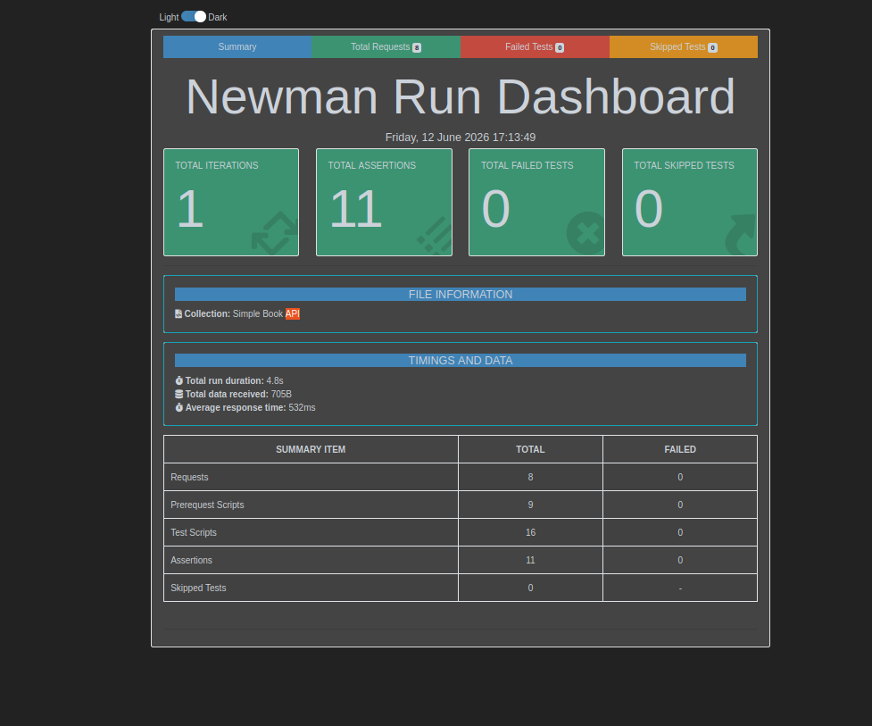

# 🚀 Automated API Testing Framework (Simple Book API)

This repository contains a fully automated API testing suite developed using **Postman** and **Newman** (CLI runner). The project simulates real-world QA automation workflows, ensuring endpoint reliability and validation.

## 🛠️ Tech Stack & Tools
- **Testing Core:** Postman
- **CLI Test Runner:** Newman
- **Reporting Engine:** `newman-reporter-htmlextra`
- **Environment:** Ubuntu Linux & JavaScript (Postman Sandbox)

## 🎯 Key Features & Test Coverage
- **End-to-End Integration:** Tests sequence validations from client registration to placing, updating, and deleting orders.
- **Dynamic Data Chaining:** Automatically extracts variables (like `accessToken` and `orderId`) from HTTP responses and passes them into subsequent requests using environment scopes.
- **Robust Assertions:** Includes status code checks (200 OK, 201 Created, 401 Unauthorized), string-to-number data type validations, array length validations, and object structural checks.
- **Negative & Edge-Case Testing:** Explicitly tests token expiration, unauthorized access, and invalid payloads to ensure solid error handling.

## 📊 Test Report Preview
Below is a visual summary of the test execution generated via the advanced HTML reporter:



## 🏃‍♂️ How to Run Locally

1. **Clone the repository:**
   
```bash
   git clone https://github.com/Alekokonjaria/automated-api-testing-postman-newman.git

